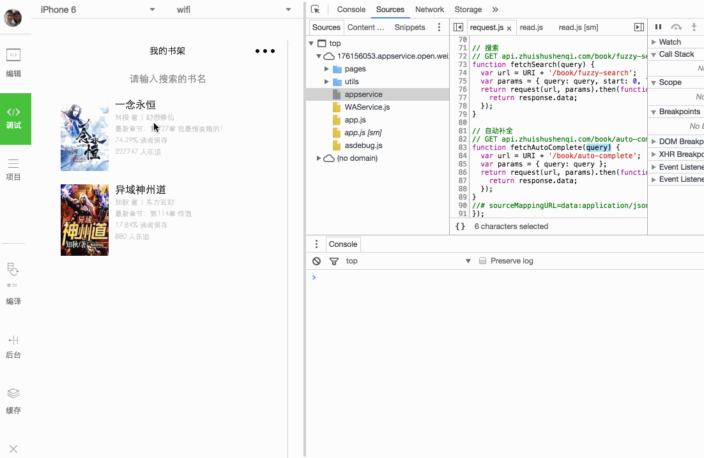

# Holy Reader
holy reader！小说阅读器小程序， API源自追书神器

## Getting Started
###  Installation

```
# 克隆仓库到指定的文件夹
$ git clone git@github.com:xifengzhu/holy-reader.git

# cd holy-reader
```

### Develop

* 在项目根目录运行 `gulp dev`
* 打开微信Web开放者工具，将下载的项目添加的 `/dist` 目录导入进去，填写或选择相应信息
* 创建新页面运行 `gulp generate --page '${page-name}'`
* 支持sass语法，gulp自动检测 `src/pages` 目录下的 `scss` 文件，自动编译成 `wxss` 放在对应的 `/dist`目录下

## Preview


